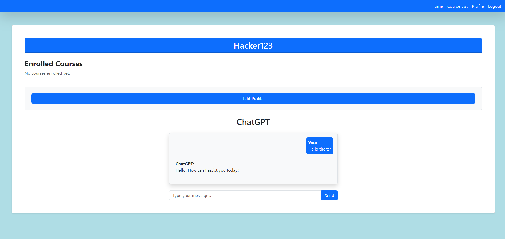

# Online-Note-Sharing-App

### Description

This is a online course tracker for any time of class, college, or certificate program.

### Table of Contents

- [Online-Note-Sharing-App](#online-note-sharing-app)
    - [Description](#description)
    - [Table of Contents](#table-of-contents)
  - [ScreenShots](#screenshots)
    - [Usage](#usage)
    - [License](#license)
    - [Contribute](#contribute)
    - [Questions](#questions)


## ScreenShots





### Usage

 * clone the repository
  ```
  npm install
  npm run develop
 ```
 

### License

[](https://opensource.org/licenses/MIT)This project is licensed under the MIT license.


### Contribute

Email Us.

### Questions

