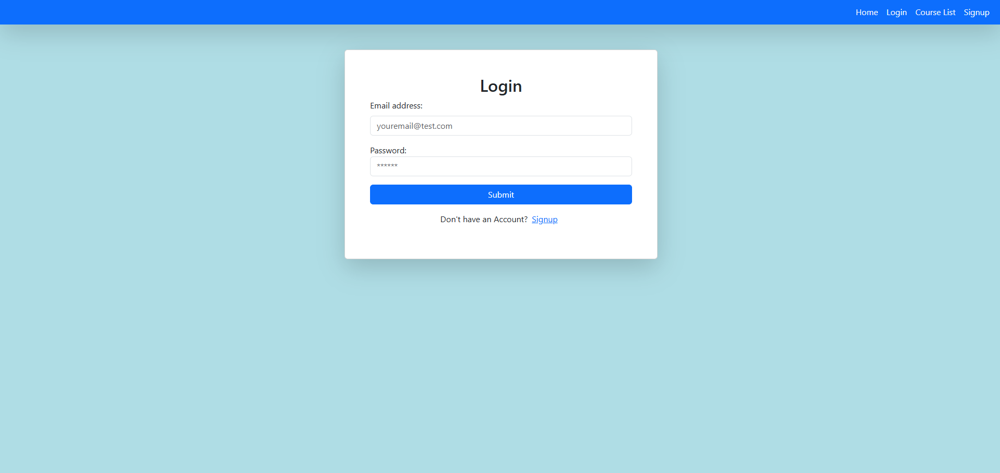
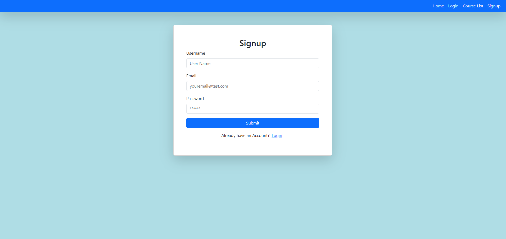
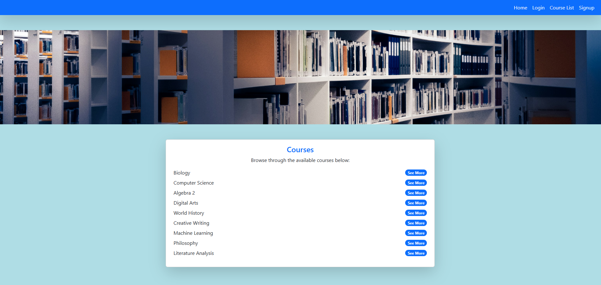
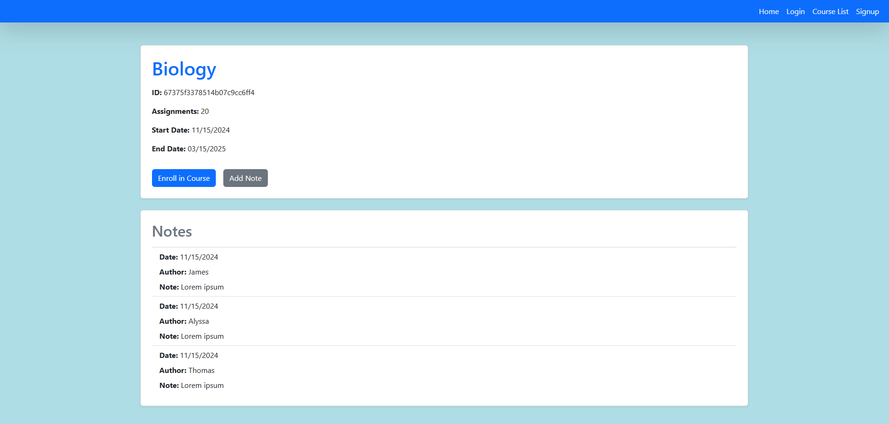

# Online-Note-Sharing-App

### Description

This is a online course tracker for any type of class, college, or certificate program. It allows you to add courses and grades. It even has Chatgpt for assistance. 

### Table of Contents

- [Online-Note-Sharing-App](#online-note-sharing-app)
    - [Description](#description)
    - [Table of Contents](#table-of-contents)
    - [Technologies Used](#technologies-used)
    - [ScreenShots](#screenshots)
    - [Usage](#usage)
    - [License](#license)
    - [Contribute](#contribute)
    - [Questions](#questions)


### Technologies Used

* Front-end
  * React.js, HTML, css, Bootstrap, openai, axios, graphql, jwt-decode
* Back-end
  * express, mongodb, mongoose, apollo/client, apollo/server 
  * bcrypt, openai, jsonwebtoken, graphql, stripe, dotenv, cors

### ScreenShots











### Usage

 * clone the repository
  ```
  npm install
  npm run develop
 ```
 

### License

[](https://opensource.org/licenses/MIT)This project is licensed under the MIT license.


### Contribute

Email Us.

### Questions

